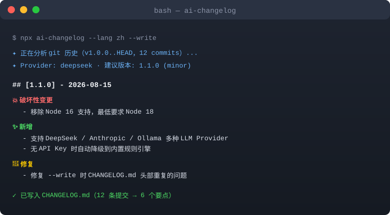

# ai-changelog

### 别再手写 release notes 了，交给 AI。

```
$ npx ai-changelog --lang zh --write
✦ 正在分析 git 历史（v1.0.0..HEAD，12 commits）...
✦ Provider: deepseek · 建议版本: 1.1.0 (minor)

## [1.1.0] - 2026-08-15

💥 破坏性变更
- 移除 Node 16 支持，最低要求 Node 18

✨ 新增
- 支持 DeepSeek / Anthropic / Ollama 多种 LLM Provider
- 无 API Key 时自动降级到内置规则引擎

🐛 修复
- 修复 --write 时 CHANGELOG.md 头部重复的问题

✓ 已写入 CHANGELOG.md（12 条提交 → 6 个要点）
```

**ai-changelog** 把两次 ref 之间的 git 历史（默认是上一个 tag 到 HEAD）变成一份简洁、可读的 changelog —— 由你选择的 LLM 驱动；没有 API Key 时，内置规则引擎照样能用。



[](https://github.com/stevengeyue/ai-changelog/actions/workflows/ci.yml)
[](LICENSE)
[](https://www.npmjs.com/package/ai-changelog)
[](https://nodejs.org)

## ✨ 特性

| | |
| --- | --- |
| ⚡ **零配置** | `npx ai-changelog` —— 无需安装、无需配置文件 |
| 🤖 **任意 LLM** | OpenAI、DeepSeek、Anthropic、Ollama，或任何 OpenAI 兼容端点 |
| 🧩 **无 Key 也能用** | 内置规则引擎自动兜底，工具永远不会"罢工" |
| 📦 **智能版本号** | 自动识别破坏性变更，建议 major/minor/patch |
| 🌍 **中英双语** | 输出简体中文或英文 |
| 🤖 **Agent 友好** | 输出干净 Markdown，可直接用于 Release Notes、PR、文档 |
| 🔧 **CI 就绪** | 内置 GitHub Action，自动生成 Release Notes |

## 🚀 快速开始

在任何 git 仓库里运行：

```bash
npx ai-changelog
```

它会自动找到上一个 tag（没有则回溯到第一个提交）、读取提交记录、输出 changelog。

一步到位：中文输出 + 写入 `CHANGELOG.md`：

```bash
npx ai-changelog --lang zh --write
```

## 🧠 LLM Provider

ai-changelog 兼容任何 OpenAI 风格 Chat API 以及 Anthropic，并会从环境变量自动识别：

| Provider | 环境变量 | 默认模型 |
| --- | --- | --- |
| OpenAI | `OPENAI_API_KEY` | `gpt-4o-mini` |
| DeepSeek | `DEEPSEEK_API_KEY` | `deepseek-chat` |
| Anthropic | `ANTHROPIC_API_KEY` | `claude-3-5-haiku-latest` |
| Ollama（本地） | `OLLAMA_HOST`（可选） | `qwen2.5:7b` |
| 自定义 | `--base-url` + 任意 Key | `--model` |

DeepSeek 示例：

```bash
export DEEPSEEK_API_KEY=sk-...
npx ai-changelog --provider deepseek --lang zh
```

本地 Ollama 示例（免费、隐私）：

```bash
npx ai-changelog --provider ollama --model qwen2.5:7b --base-url http://localhost:11434/v1
```

> 🔑 **没有 API Key？** 直接运行即可。找不到 Key（或 LLM 调用失败）时，ai-changelog 自动降级到确定性规则引擎，依然能生成清晰分组的中文/英文 changelog，只是少了 LLM 的"润色"。

## 📦 智能版本号

ai-changelog 会分析提交并建议下一个 semver 版本：

| 信号 | 建议 |
| --- | --- |
| `!` 或 `BREAKING CHANGE` | **major** |
| `feat` | **minor** |
| `fix` / `perf` / 其他 | **patch** |

版本号从上个 tag（如 `v1.2.3`）读取并自动递增，也可用 `--set-version 2.0.0` 手动指定。

## 🖥️ CLI 参数

```text
Usage: ai-changelog [options]

Options:
  --repo <path>        git 仓库路径（默认：当前目录）
  --from <ref>         起始 ref（默认：上一个 tag）
  --to <ref>           结束 ref（默认：HEAD）
  --provider <name>    openai | deepseek | anthropic | ollama | auto（默认：auto）
  --model <name>       LLM 模型名
  --api-key <key>      API Key（或用 <PROVIDER>_API_KEY 环境变量）
  --base-url <url>     自定义 OpenAI 兼容端点
  --lang <lang>        en | zh（默认：en）
  --format <format>    terminal | md | json（默认：terminal）
  --set-version <v>    手动指定版本号（如 1.2.0）
  --write              把新版本段落写入 CHANGELOG.md
  --no-llm             强制使用内置规则引擎
  -h, --help           帮助
```

## 🤖 GitHub Action

每次发布自动生成 Release Notes：

```yaml
name: Generate Release Notes

on:
  release:
    types: [created]

jobs:
  changelog:
    runs-on: ubuntu-latest
    permissions:
      contents: write
    steps:
      - uses: actions/checkout@v4
        with:
          fetch-depth: 0
      - uses: stevengeyue/ai-changelog@main
        id: gen
        with:
          provider: deepseek
          lang: zh
        env:
          DEEPSEEK_API_KEY: ${{ secrets.DEEPSEEK_API_KEY }}
      - uses: softprops/action-gh-release@v2
        with:
          body: ${{ steps.gen.outputs.changelog }}
```

## 🏗️ 工作原理

1. **收集** —— 读取 base ref（默认上一个 tag）到 HEAD 之间的提交。
2. **解析** —— 识别 Conventional Commits（`feat(scope): desc`、`!`、`BREAKING CHANGE`）及普通消息。
3. **生成** —— 让 LLM 把提交归类为 新增/变更/修复/移除/破坏性，聚焦用户可见的影响；任何失败自动降级到规则引擎。
4. **输出** —— 终端、Markdown 或 JSON，可选写入 `CHANGELOG.md`。

## 🧪 开发

```bash
npm install
npm run check   # 类型检查
npm test        # 单元测试
npm run build   # tsc -> dist
node dist/cli.js --no-llm   # 本地体验
```

## 🗺️ 路线图

- [ ] 根据仓库主要提交语言自动选择 changelog 语言
- [ ] GitHub App 机器人：在 PR 上自动评论生成的 release notes
- [ ] 模板定制（自定义分组名、emoji 开关）
- [ ] Diff 感知摘要：大变更时附带 `--stat` 上下文

## 📄 许可证

[MIT](LICENSE) © ai-changelog contributors
